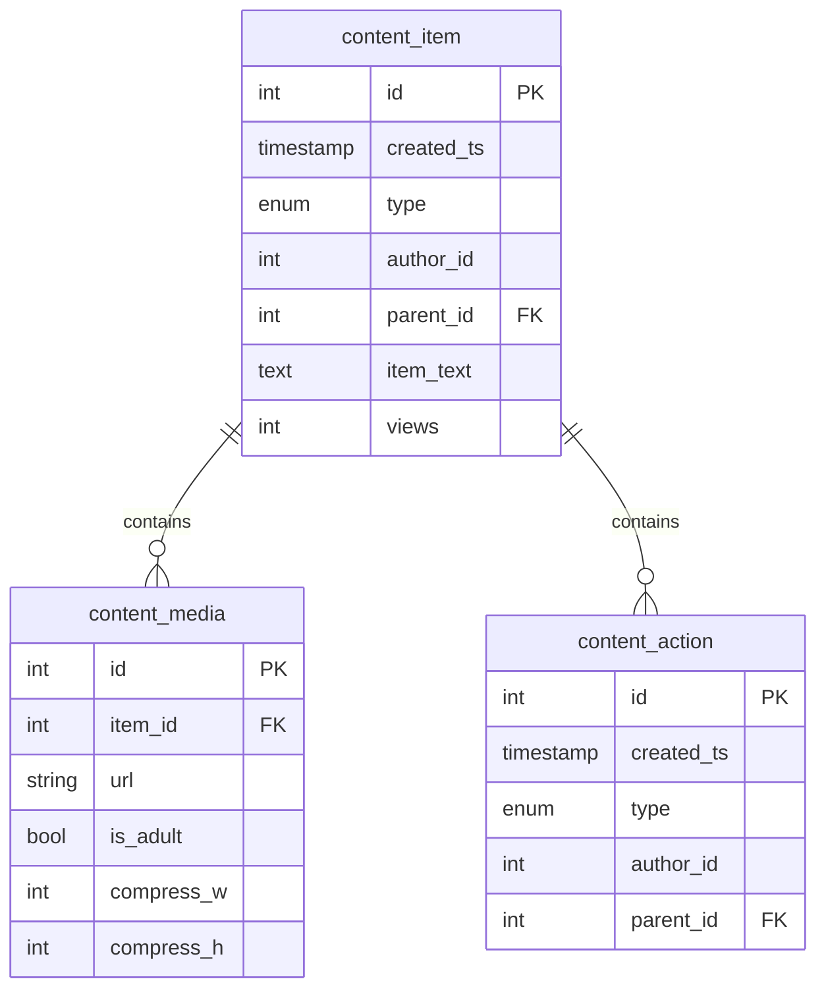

```mermaid
erDiagram
    content_item {
        int id PK
        timestamp created_ts
        enum type
        int author_id
        int parent_id FK
        text item_text
        int views
    }

    content_media {
        int id PK
        int item_id FK
        string url
        bool is_adult
        int compress_w
        int compress_h
    }

    content_action {
        int id PK
        timestamp created_ts
        enum type
        int author_id
        int parent_id FK
    }

    content_item ||--o{ content_media : contains
    content_item ||--o{ content_action : contains
```
