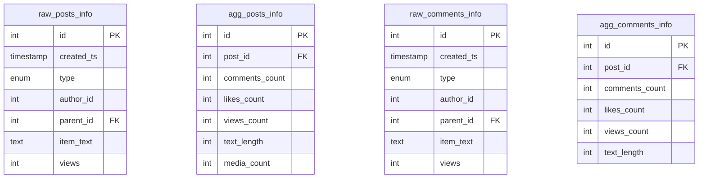

```mermaid
erDiagram
    raw_posts_info {
        int id PK
        timestamp created_ts
        enum type
        int author_id
        int parent_id FK
        text item_text
        int views
    }

    agg_posts_info {
        int id PK
        int post_id FK
        int comments_count
        int likes_count
        int views_count
        int text_length
        int media_count
    }

    raw_comments_info {
        int id PK
        timestamp created_ts
        enum type
        int author_id
        int parent_id FK
        text item_text
        int views
    }

    agg_comments_info {
        int id PK
        int post_id FK
        int comments_count
        int likes_count
        int views_count
        int text_length
    }
```