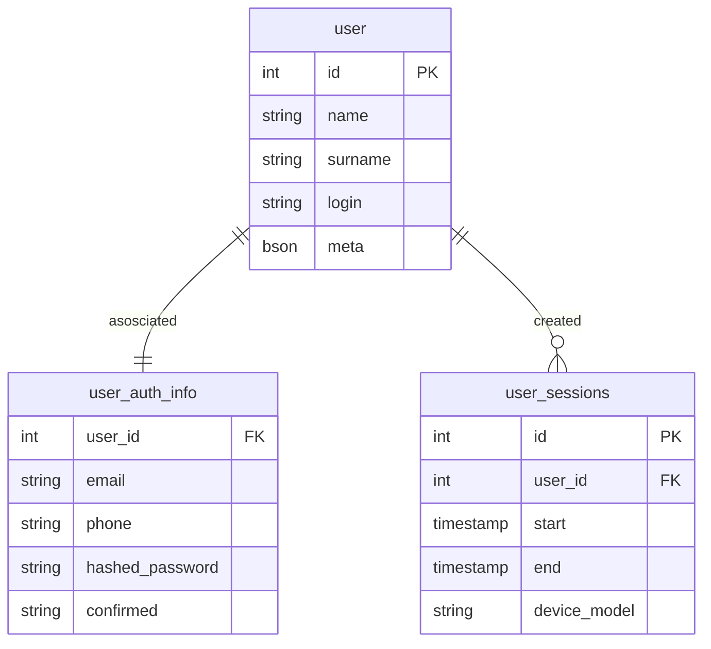

```mermaid
erDiagram
    user {
        int id PK
        string name
        string surname
        string login
        bson meta
    }

    user_auth_info {
        int user_id FK
        string email
        string phone
        string hashed_password
        string confirmed
    }


     user_sessions {
        int id PK
        int user_id FK
        timestamp start
        timestamp end
        string device_model
     }

     user ||--|| user_auth_info : asosciated
     user ||--o{ user_sessions: created
```